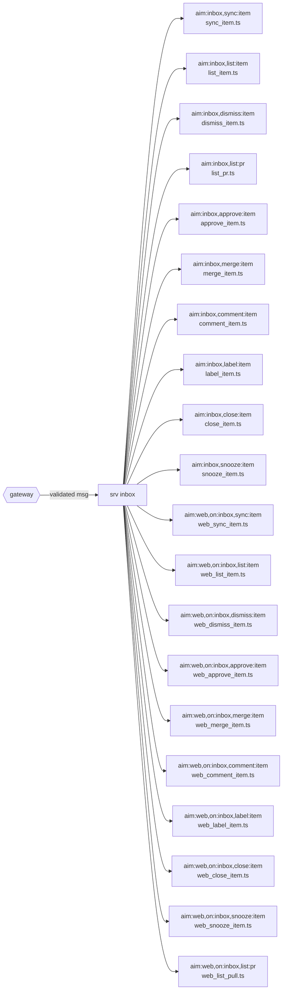

# Service: inbox (generated)

<!-- AUTO-GENERATED from the model by @voxgig/build (doc_gen) - do not edit. -->

Answers `aim:inbox`, `aim:web` messages, loaded by convention (`@voxgig/system` MakeSrv): each
message maps to the action file named after its last pattern pair.

## Messages

| Message | Action file |
|---|---|
| `aim:inbox,sync:item` | `sync_item.ts` |
| `aim:inbox,list:item` | `list_item.ts` |
| `aim:inbox,dismiss:item` | `dismiss_item.ts` |
| `aim:inbox,list:pr` | `list_pr.ts` |
| `aim:inbox,approve:item` | `approve_item.ts` |
| `aim:inbox,merge:item` | `merge_item.ts` |
| `aim:inbox,comment:item` | `comment_item.ts` |
| `aim:inbox,label:item` | `label_item.ts` |
| `aim:inbox,close:item` | `close_item.ts` |
| `aim:inbox,snooze:item` | `snooze_item.ts` |
| `aim:web,on:inbox,sync:item` | `web_sync_item.ts` |
| `aim:web,on:inbox,list:item` | `web_list_item.ts` |
| `aim:web,on:inbox,dismiss:item` | `web_dismiss_item.ts` |
| `aim:web,on:inbox,approve:item` | `web_approve_item.ts` |
| `aim:web,on:inbox,merge:item` | `web_merge_item.ts` |
| `aim:web,on:inbox,comment:item` | `web_comment_item.ts` |
| `aim:web,on:inbox,label:item` | `web_label_item.ts` |
| `aim:web,on:inbox,close:item` | `web_close_item.ts` |
| `aim:web,on:inbox,snooze:item` | `web_snooze_item.ts` |
| `aim:web,on:inbox,list:pr` | `web_list_pull.ts` |

## Flow

Message params are validated from the model (gubu); see
`../../../model/` and `docs/reference/messages.md` at the project root.
