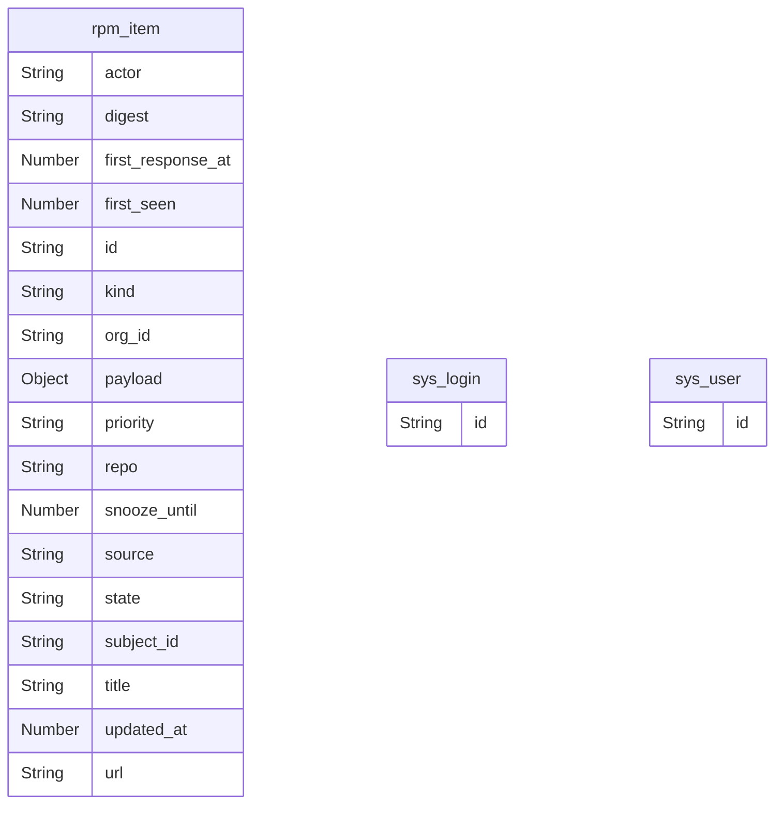

# Reference: entities (generated)

<!-- AUTO-GENERATED from the model by @voxgig/build (doc_gen) - do not edit. -->

*Diátaxis: reference — the entity graph, derived from the model.*

## Entity relationship diagram

Relationships come from `ref` fields (the field stores the id of the
target entity).

(Entity ids are canons with `/` shown as `_`.)

## Entities

| Canon | Fields | Relationships | UI |
|---|---|---|---|
| `rpm/item` | actor, digest, first_response_at, first_seen, id, kind, org_id, payload, priority, repo, snooze_until, source, state, subject_id, title, updated_at, url | — | generic admin |
| `sys/login` | id | — | generic admin |
| `sys/user` | id | — | generic admin |
