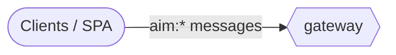

# Reference: messages (generated)

<!-- AUTO-GENERATED from the model by @voxgig/build (doc_gen) - do not edit. -->

*Diátaxis: reference — services and the messages they answer, derived
from the model. Action files follow the MakeSrv convention (last
pattern pair: `save:item` → `save_item`).*

## Message flow

