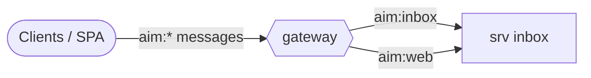

# Reference: messages (generated)

<!-- AUTO-GENERATED from the model by @voxgig/build (doc_gen) - do not edit. -->

*Diátaxis: reference — services and the messages they answer, derived
from the model. Action files follow the MakeSrv convention (last
pattern pair: `save:item` → `save_item`).*

## Message flow

## Service: inbox

| Message | Action file |
|---|---|
| `aim:inbox,sync:item` | `src/srv/inbox/sync_item.ts` |
| `aim:inbox,list:item` | `src/srv/inbox/list_item.ts` |
| `aim:inbox,dismiss:item` | `src/srv/inbox/dismiss_item.ts` |
| `aim:web,on:inbox,sync:item` | `src/srv/inbox/web_sync_item.ts` |
| `aim:web,on:inbox,list:item` | `src/srv/inbox/web_list_item.ts` |
| `aim:web,on:inbox,dismiss:item` | `src/srv/inbox/web_dismiss_item.ts` |
