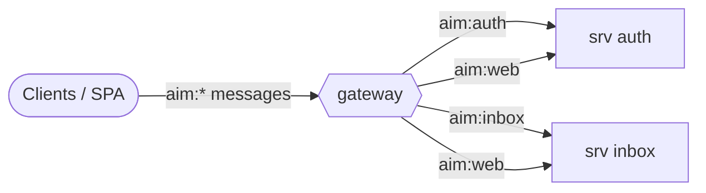

# Reference: messages (generated)

<!-- AUTO-GENERATED from the model by @voxgig/build (doc_gen) - do not edit. -->

*Diátaxis: reference — services and the messages they answer, derived
from the model. Action files follow the MakeSrv convention (last
pattern pair: `save:item` → `save_item`).*

## Message flow

```mermaid
flowchart LR
  client([Clients / SPA])
  gateway{{gateway}}
  client -->|aim:* messages| gateway
  auth[srv auth]
  gateway -->|aim:auth| auth
  gateway -->|aim:web| auth
  inbox[srv inbox]
  gateway -->|aim:inbox| inbox
  gateway -->|aim:web| inbox
```

## Service: auth

| Message | Action file |
|---|---|
| `aim:auth,signin:user` | `src/srv/auth/signin_user.ts` |
| `aim:auth,signout:user` | `src/srv/auth/signout_user.ts` |
| `aim:auth,load:auth` | `src/srv/auth/load_auth.ts` |
| `aim:web,on:auth,signin:user` | `src/srv/auth/web_signin_user.ts` |
| `aim:web,on:auth,signout:user` | `src/srv/auth/web_signout_user.ts` |
| `aim:web,on:auth,load:auth` | `src/srv/auth/web_load_auth.ts` |

## Service: inbox

| Message | Action file |
|---|---|
| `aim:inbox,sync:item` | `src/srv/inbox/sync_item.ts` |
| `aim:inbox,list:item` | `src/srv/inbox/list_item.ts` |
| `aim:inbox,dismiss:item` | `src/srv/inbox/dismiss_item.ts` |
| `aim:inbox,undo:item` | `src/srv/inbox/undo_item.ts` |
| `aim:inbox,list:reply` | `src/srv/inbox/list_reply.ts` |
| `aim:inbox,list:pr` | `src/srv/inbox/list_pr.ts` |
| `aim:inbox,list:issue` | `src/srv/inbox/list_issue.ts` |
| `aim:inbox,list:drift` | `src/srv/inbox/list_drift.ts` |
| `aim:inbox,plan:policy` | `src/srv/inbox/plan_policy.ts` |
| `aim:inbox,list:external` | `src/srv/inbox/list_external.ts` |
| `aim:inbox,load:pr` | `src/srv/inbox/load_pr.ts` |
| `aim:inbox,approve:item` | `src/srv/inbox/approve_item.ts` |
| `aim:inbox,merge:item` | `src/srv/inbox/merge_item.ts` |
| `aim:inbox,comment:item` | `src/srv/inbox/comment_item.ts` |
| `aim:inbox,label:item` | `src/srv/inbox/label_item.ts` |
| `aim:inbox,close:item` | `src/srv/inbox/close_item.ts` |
| `aim:inbox,snooze:item` | `src/srv/inbox/snooze_item.ts` |
| `aim:web,on:inbox,sync:item` | `src/srv/inbox/web_sync_item.ts` |
| `aim:web,on:inbox,list:item` | `src/srv/inbox/web_list_item.ts` |
| `aim:web,on:inbox,dismiss:item` | `src/srv/inbox/web_dismiss_item.ts` |
| `aim:web,on:inbox,undo:item` | `src/srv/inbox/web_undo_item.ts` |
| `aim:web,on:inbox,list:reply` | `src/srv/inbox/web_list_reply.ts` |
| `aim:web,on:inbox,approve:item` | `src/srv/inbox/web_approve_item.ts` |
| `aim:web,on:inbox,merge:item` | `src/srv/inbox/web_merge_item.ts` |
| `aim:web,on:inbox,comment:item` | `src/srv/inbox/web_comment_item.ts` |
| `aim:web,on:inbox,label:item` | `src/srv/inbox/web_label_item.ts` |
| `aim:web,on:inbox,close:item` | `src/srv/inbox/web_close_item.ts` |
| `aim:web,on:inbox,snooze:item` | `src/srv/inbox/web_snooze_item.ts` |
| `aim:web,on:inbox,list:pr` | `src/srv/inbox/web_list_pr.ts` |
| `aim:web,on:inbox,list:issue` | `src/srv/inbox/web_list_issue.ts` |
| `aim:web,on:inbox,list:drift` | `src/srv/inbox/web_list_drift.ts` |
| `aim:web,on:inbox,list:external` | `src/srv/inbox/web_list_external.ts` |
| `aim:web,on:inbox,load:pr` | `src/srv/inbox/web_load_pr.ts` |
