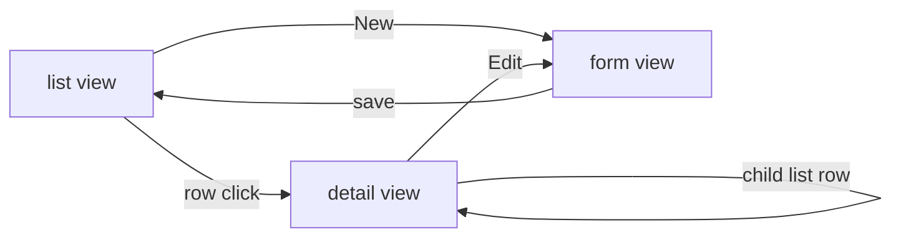

# Component: vg-entity-admin (`cmp/admin.js`)

The generic, model-driven entity admin: list, detail (with relationship
drill-down), and form for ANY entity — columns, fields, ref pickers and
child lists all derive from the model at runtime. One component serves
the whole entity graph.

## View flow

- **List**: columns from `Model.displayFields`; ref fields render as
  links (`onNavigate` to the target entity); project-scoped entities
  filter by the shell's current project.
- **Detail**: the entity's fields plus an inline child list per inverse
  relationship (entities whose `ref` points here) — the drill-down.
- **Form**: inputs by field kind; `ref` fields become `select` pickers
  loaded from the target entity; parent refs preset when creating from a
  detail view.

## Messages

All data via `api.js` → generic entity service:
`aim:ent,cmd:list|load|save|remove, ent:<canon>`. Emits
`projects-changed` after project writes.

## Async rendering

Renders are async (data fetches) and can overlap; a **render token**
(`begin()` / `current(tok)`) discards stale renders — capture the token
at method start, bail before writing `innerHTML` if superseded. Keep
this pattern in any new async render path.

## Customisation

| Hook point | Kind |
|---|---|
| `admin:list:toolbar` / `admin:row:actions` / `admin:form:extra` | html |
| `admin:list:items` / `admin:list:columns` / `admin:form:fields` / `admin:save:data` | filter |
| `admin:list:after` / `admin:form:after` / `admin:save:after` | action |

To replace this UI wholesale for one entity, use a custom view
(`ux:{view:'custom'}` in the model).
