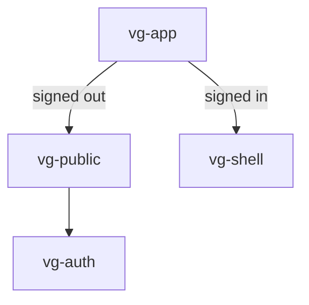

# Component: vg-app (`cmp/app.js`)

The root router component: mounts the public site or the authenticated
shell depending on auth state, and re-routes when that state changes.

## Structure

## Messages

| Message | Direction | Purpose |
|---|---|---|
| `cmp:auth,load:state` | post | Trigger initial auth load on mount |
| `cmp:evt,name:auth` (event `auth`) | sub via `onEvent` | Re-route on sign-in / sign-out |

## Notes

- Mounted once from `index.html`; everything else hangs off it.
- Re-routing replaces `innerHTML`, tearing down the previous subtree —
  long-lived components must tolerate re-mounts (see the `isConnected`
  guard convention in shell/admin).
