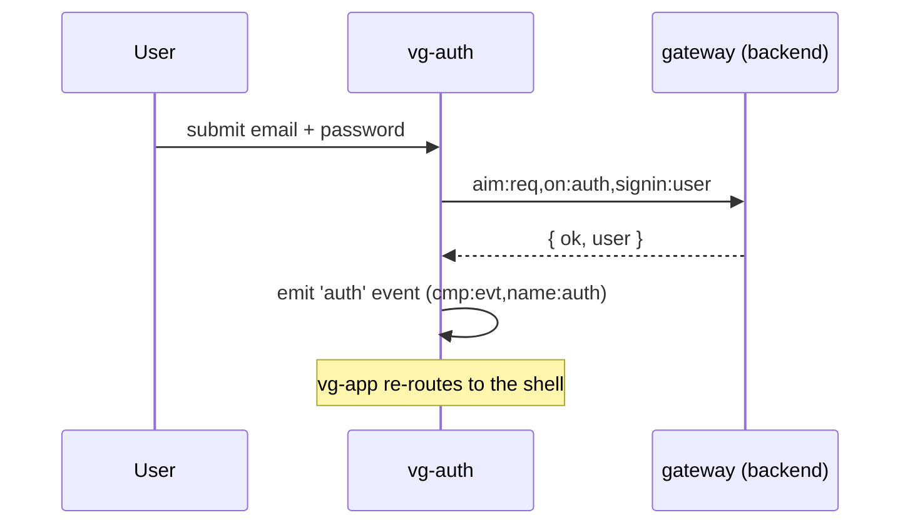

# Component: vg-auth (`cmp/auth.js`)

The sign-in form (with forgot-password), and the client-side `cmp:auth`
state service other components query.

## Message flow

## Messages

| Message | Direction | Purpose |
|---|---|---|
| `cmp:auth,load:state` | answers | Load the session (`aim:req,on:auth,load:auth`) |
| `cmp:auth,get:state` | answers | Current `{ user }` for other components |
| `cmp:auth,signin:user` | answers | Sign in, then emit `auth` |
| `cmp:auth,signout:user` | answers | Sign out, then emit `auth` |
| `aim:req,on:auth,remind:pass` | post | Forgot-password (server stub; no email sent) |
| event `auth` | emit | Auth state changed (the store cache also clears on this) |

## Customisation

| Hook point | Kind | Effect |
|---|---|---|
| `auth:form:footer` | html | Extra links/markup under the form |
