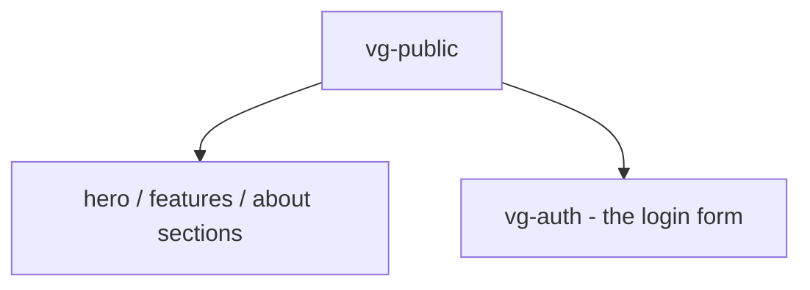

# Component: vg-public (`cmp/public.js`)

The public content site shown to signed-out visitors: marketing sections
(hero, features, about) plus the sign-in form.

## Structure

## Customisation

| Hook point | Kind | Effect |
|---|---|---|
| `public:sections` | html | Append extra marketing sections |

Static content is meant to be edited directly — this component is
create-once and project-owned; replace the copy with your product's.

## Messages

None of its own — sign-in flows through the embedded `vg-auth`.
