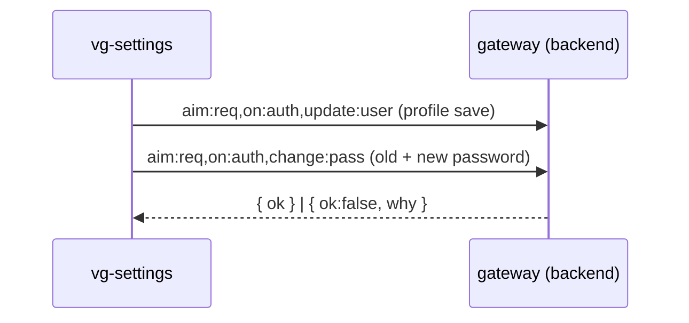

# Component: vg-settings (`cmp/settings.js`)

User settings & security: profile (name/email) and change-password.
Mounted in the shell's main area from the user menu.

## Message flow

## Messages

| Message | Direction | Purpose |
|---|---|---|
| `cmp:auth,get:state` | post | Current user to populate the form |
| `aim:req,on:auth,update:user` | post (via `api.js`) | Save profile |
| `aim:req,on:auth,change:pass` | post (via `api.js`) | Change password (min length 8) |

## Customisation

| Hook point | Kind | Effect |
|---|---|---|
| `settings:sections` | html | Extra settings sections |
