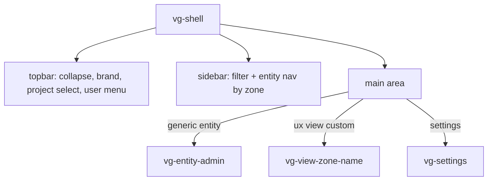

# Component: vg-shell (`cmp/shell.js`)

The authenticated enterprise app shell: top bar (brand, project
selector, user menu), collapsible left entity menu, and the main area
hosting the entity admin (generic or custom view) or settings. Entirely
model-driven — the entity menu and view routing come from `model.js`.

## Structure

## Behaviour

- **Navigation**: `openEntity(canon, detailId?)` mounts the right
  component for the entity (`Model.customViewTag(canon)` or the generic
  admin), sets props (`canon`, `projectId`, `detailId`, `onNavigate`)
  and calls `reload()`.
- **Project context**: the project `select` (or opening a project's
  detail) sets `currentProjectId`; project-scoped entities re-list when
  it changes.
- **Theme**: the user menu shows a mode toggle when the model declares
  more than one theme mode (`theme.js`).

## Messages

| Message | Direction | Purpose |
|---|---|---|
| `cmp:auth,get:state` | post | Current user for the user menu |
| `cmp:auth,signout:user` | post | Sign out |
| `aim:ent,cmd:list` (via `api.js`) | post | Project list for the selector |
| event `projects-changed` | sub | Refresh the project selector (guarded with `isConnected`) |

## Customisation

| Hook point | Kind | Effect |
|---|---|---|
| `shell:topbar:right` | html | Markup before the user menu |
| `shell:sidebar:top` | html | Markup above the entity filter |
| `shell:nav:items` | filter | Reorder/filter/relabel the entity menu |
